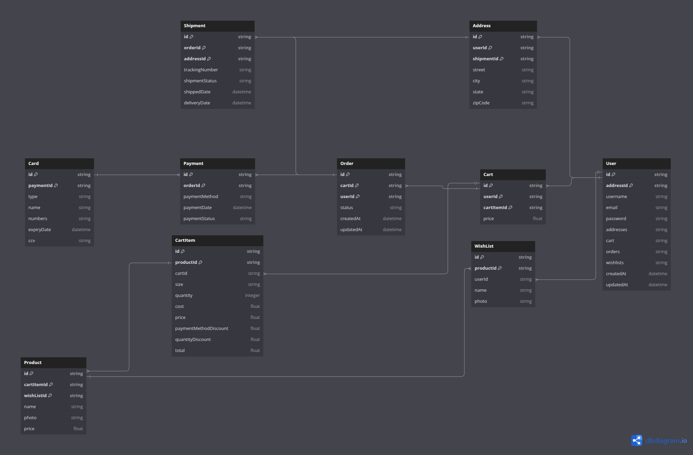

<p align="center">
    
</p>
<h1 align="center"> NYA STORE </h1>

<p align="center">
🐱 E-commerce built with Next.js, Redux Toolkit, Prisma and PostgreSQL 🛒
</p>

<br>

## 🚀 Tech Stack

| Technology  | Version  |
| ----------- | -------- |
| Next.js     | 15.2.1   |
| React       | 19.0.0   |
| TypeScript  | ^5       |
| Prisma ORM  | ^6.5.0   |
| NextAuth.js | ^4.24.11 |
| Sass        | ^1.85.1  |

<br>

## 📦 Libraries

- **Prisma** – Database ORM 🗄️
- **NextAuth.js** – Authentication 🔐
- **bcrypt** – Password hashing 🔑
- **React Hook Form** – Form handling 📝
- **Sass** – Stylish styling 💅
- **ESLint** – Code linting 🚨

<br>

## 🗄️ Database

<p align="center">
    <a href="https://dbdiagram.io/d/nya-store-666152b99713410b05e47081">
        
    </a>
</p>

<br>

## 📜 Scripts

Run these commands to get started:

```sh
# Start dev server
npm run dev

# Build for production
npm run build

# Start production server
npm start

# Lint code
npm run lint
```

<br>

## 🎮 Demo

🚧 _Coming soon... Stay tuned!_ 🚧

<br>

## 📬 Contact

- 💌 Email: **nadyajerochim@gmail.com**
- 💼 LinkedIn: [/nady4](https://www.linkedin.com/in/nady4)
- 👩🏻‍💻 GitHub: [@nady4](https://github.com/nady4)
